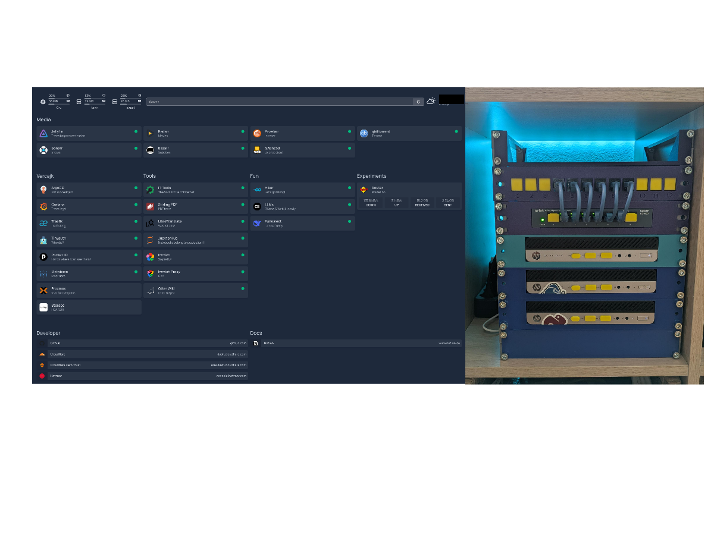

# Gru-Ops

This is my tiny homelab, running k8s with Talos OS, build from three mini PCs.
GitOps-style with ArgoCD, exposing some apps to the internet with Cloudflare tunnel & Pocket-id.

## Cluster

| Name   | Node                       | CPU                                                                  | RAM    | HDD          | Second HDD | OS             | Power |
|--------|----------------------------|----------------------------------------------------------------------|--------|--------------|------------|----------------|-------|
| Kevin  | HP EliteDesk 800 G3 Mini   | Intel Quad Core i5 7500 3,40 GHz (4 cores, 4 threads, 6MB cache)    | 40GiB  | 256 GB NVMe  | 500 GB SSD | Talos (master) | 65W   |
| Stuart | HP EliteDesk 800 G3 Mini   | Intel Quad Core i5 7500 3,40 GHz (4 cores, 4 threads, 6MB cache)    | 40 GB  | 256 GB NVMe  | 500 GB SSD | Talos          | 65W   |
| Bob    | HP EliteDesk 800 G3 Mini   | Intel Quad Core i5 7600T 2.8GHz (4 cores, 4 threads, 6MB cache)     | 16 GB  | 256 GB NVMe  | N/A        | Proxmox        | 35W   |

## NAS

`Synology DS920+` aka Choko
- Intel Celeron J4125 2.0 GHz *(4 cores, 4 threads, 4MB cache, 10W)*
- 4GB DDR4 RAM (added +8GB myself), two 1GbE ports, and two M.2 NVMe slots for SSD caching.
- 2x 4TB WD Red (WD40EFRX)
